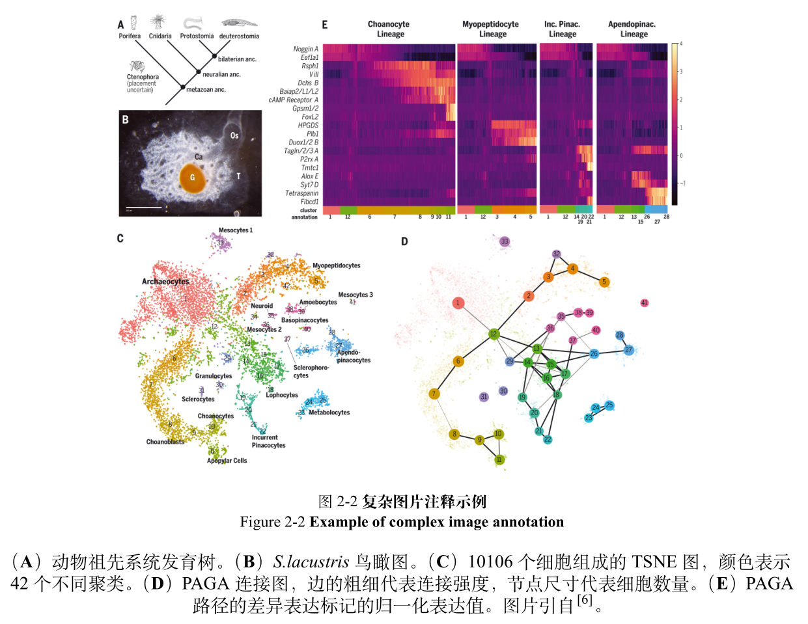
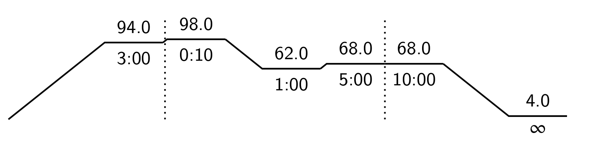

# 中山大学研究生学位论文 $\LaTeX$ 模板（试用,生科院微调版）

本模板基于现有的[中山大学研究生学位论文模板](https://github.com/1FCENdoge/SYSUThesis)(感谢[@1FCENdoge](https://github.com/1FCENdoge)!)，在其基础上做了一点点微调，以更符合生科院的要求。
与这一模板相比，本模板的主要调整详见[针对生科院要求的主要微调内容](#针对生科院要求的主要微调内容)和[其他添加的内容和功能](#其他添加的内容和功能)。
本人已经使用该模板完成硕士学位论文，并通过学院的格式检查。
如果存在其他问题也欢迎提 issue。


## 如何使用

### TeX Live 编译（本地）

本模板目前在 Linux 环境下已经进行测试，Windows 用户如果通过 Powershell/CMD 编译可能需要安装 sed 命令（更推荐在 WSL 环境下进行编译）。

本模板需要使用 TeX Live(>=2017) 进行编译，建议使用 `make` 工具进行编译：

```
make pdf        # 编译生成论文 main.pdf (会自动执行 clean 命令)
make clean      # 删除编译过程中生成的临时文件
```

## 针对生科院要求的主要微调内容

### 扉页

根据生科院扉页模板重新绘制了论文扉页。
生科院提供的扉页模板使用 Word 的文档网络进行排版，本模板没有忠实的进行还原，而是大致的模拟了其效果。~~但是我看了一些其他同学和往年的研究生论文，这方面都参差不齐~~

### 摘要

针对生科院要求调整了封面格式，主要改动为：
- 调整字号
- 标题名称只包括内容
- "摘要"/"ABSTRACT" 左对齐而不是居中对齐

### 中英文双语图表注释

生科院要求所有图表必须有中英文图表注释。
这里引入 `bicaption` 宏包来解决。

一些复杂的图表还有添加更详细的图表注释的需求，例如说明图片中不同子图的详细信息，说明图片中不同元素以及颜色的含义。
这些内容不应该出现在论文开端的图表目录中，同时在正文中也需要与图表的主标题进行区分（例如主标题使用粗体，同时两个部分应该有所间隔）

这里定义了 `bicaptionX` 命令，包装了一个较为简单的实现：

```latex
% 不需要添加注释的情况
\bicaptionX{中文标题}{English Title}

% 添加注释的情况
\bicaptionX{中文标题}{English Title}{注释}

```

其具体效果如下：



如果对这一实现不够满意，也可以参考 bicaption 的[宏包文档](https://ftp.yz.yamagata-u.ac.jp/pub/CTAN/macros/latex/contrib/caption/bicaption.pdf)进行自定义。


### 清理bib文件中物种名称的斜体环境

在常见的英文参考文献格式中，物种名称通常用斜体表示。
对应到 bib 文件中，物种名称会用 `\emph{}` 的环境扩起来，并在 biblatex 编译后最终得到正确的表示。
而在 GB/T 7714-2015 的官方文件中，没有明确看到这一要求。

模板使用了 [GB/T 7714-2015 BibTeX Style](https://github.com/zepinglee/gbt7714-bibtex-style) 项目提供的官方 bibstyle，在这一 bst 文件下 `\emph{}` 环境会被处理成下划线而不是斜体。

因此多一事不如少一事~~其实是我比较菜不会改bst~~，添加了一个自动检测并替换 `\emph` 的简单 sed 命令去掉所有的物种名斜体环境，并在使用 `make pdf` 编译文档时自动执行。

也可以只在最开始执行一次 sed 命令修改 reference.bib ，之后都可以正常编译：
```bash
sed -i "s/\\\emph{/{/g" reference.bib
```

或者打开 reference.bib 文件，手动去除所有 `\emph` 字段。

### 其他

- 符号说明放到了附录中。

## 其他添加的内容和功能

### PCR 热力学条件绘制

为了方便绘制 PCR 反应的热力学条件，本模板借鉴了[相关讨论](https://tex.stackexchange.com/questions/430508/how-to-draw-a-diagram-of-pcr-cycle)包装了一个函数。

函数包括两个参数，前面一个参数为默认参数，控制绘制的 PCR 图的大小，默认为 0.4；后面一个参数为描述 PCR 反应条件的序列:

```latex
\drawPCR[比例]{反应序列}
```

序列由一系列的 PCR 反应条件组成，反应条件间由逗号分隔。每个反应条件包括三个值：反应温度、反应时间、是否绘制虚线区分不同的循环（用0和1表示）。例如一个常规的 PCR 反应可以使用 “94.0/3:00/0,98.0/0:10/1,62.0/1:00/0,68.0/5:00/0,68.0/10:00/1,4.0/$\infty$/0” 进行表示。

其绘制效果如下图所示:



### CSV 自动转换三线表

为了尽可能的~~偷懒~~节省精力，本模板还引入了 `csvsimple` 包用于自动将表格转换为三线表。

如果对表格的效果没有过多要求，可以直接使用如下代码，简单的用 csv 直接获得一个三线表。

```latex
\begin{table}
	\csvautobooktabular{table/asterids.csv}
\end{table}
```


## 相关规范
- [中山大学研究生学位论文格式要求](http://graduate.sysu.edu.cn/rules)
- [生命而科学学院关于研究生论文格式的补充说明(2016年4月修订)](https://lifesciences.sysu.edu.cn/graduate/degree/415)

## 项目代码参考
1. [中山大学LaTeX论文项目模板](https://github.com/SYSU-SCC/sysu-thesis)
1. [GB/T 7714-2015 BibTeX Style](https://github.com/zepinglee/gbt7714-bibtex-style)（官方宏包）
1. [中山大学研究生学位论文LaTeX模板（试用）](https://github.com/1FCENdoge/SYSUThesis)

## 未来改进计划 

- [ ] 支持 R 代码渲染
- [ ] 支持 shell 代码渲染
- [ ] 提供 DNA/蛋白 序列的显示函数，支持针对不同核苷酸/氨基酸字符自动上色

~~画饼~~长期计划，欢迎合作：
- [ ] 使用 quarto/Rmarkdown 直接编译毕业论文，整合数据处理、图片绘制和文字排版
- [ ] 使用 typst 编译毕业论文，获得更好的编译速度
- [ ] 和其它研究生论文模板合并，构建跨学院的统一模板

## 致谢
1. 感谢[@1FCENdoge](https://github.com/1FCENdoge) 提供了一个全面的论文模板，使得在其基础上可以比较轻松的进行调整以符合要求 